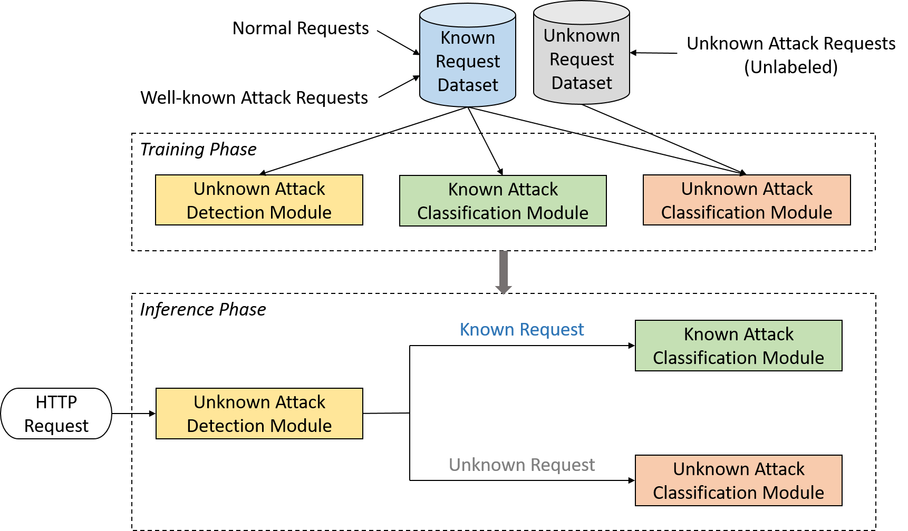

# NLP IN DEEP LEARNING FOR ANOMALOUS HTTP REQUEST DETECTION

This repo consists of three main modules to detect not only well-known web-attacks but also new types of attacks by using NLP, Deep Learning and Transfer Learning. The overall architecture is depicted below:

The procedure for training each module is described in (Please read carefully the readme file in each folder):
1. training_attack_discovering folder
2. training_known_classification_module folder
3. training_unknown_classification_module folder

Dataset for training and evaluating:
- Drive path: https://drive.google.com/drive/folders/1I8fS2uSv4v3tlmVcuzzC07QTHWjFOCUr
- Script for re-produce dataset: 
[Data_Processing_Combine.ipynb](Data_Processing_Combine.ipynb)
- You can modify the script to re-produce your own dataset that fits into your model
- The dataset may not up-to-date so please contact the author if you have any questions
